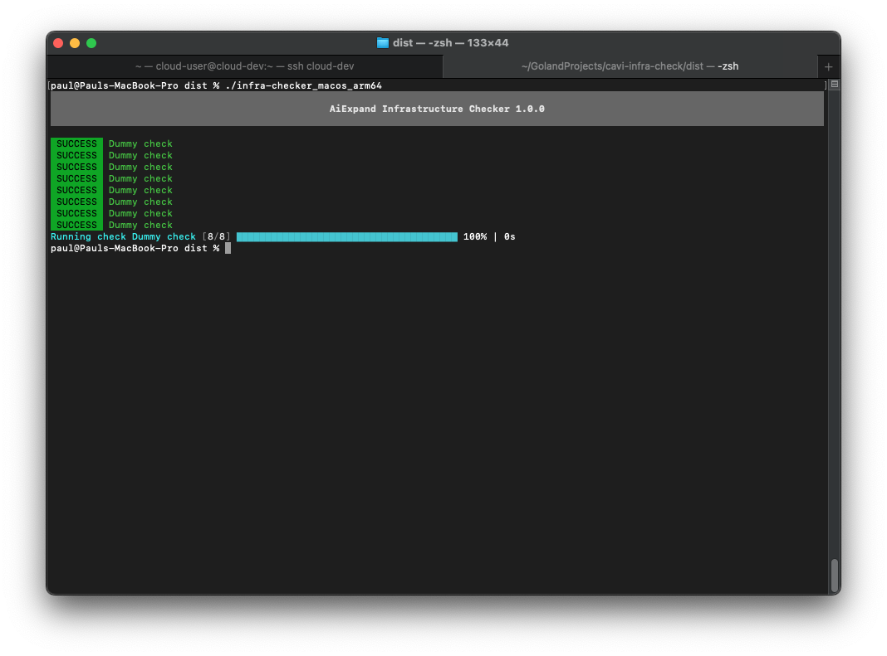
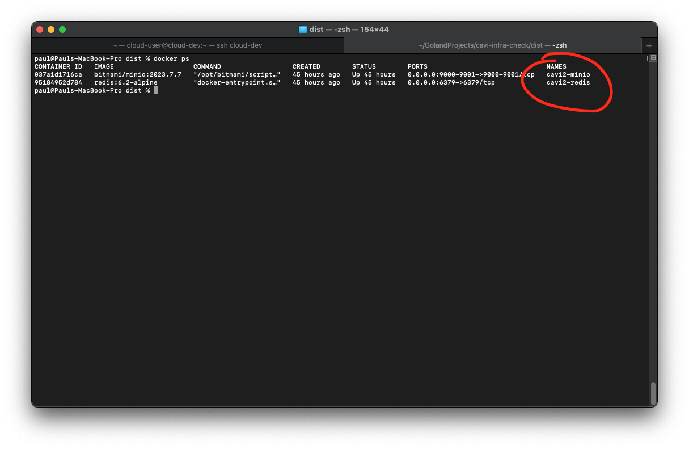

# AiXpand Infrastructure Checker



The infrastructure checker is a proactive and configurable command line tool that enables the user to diagnose potential problems within the infrastructure.

## 1. Installation

The installation process is a straight forward process, just copy the binary from GitHub releases [here](https://github.com/AiXpand/infra-check/releases) and copy it to the node that you want to test, copy the configuration file from [here](https://raw.githubusercontent.com/AiXpand/infra-check/main/config.sample.json), and configure the necessary checks.

**On linux:

Ensure the binary is executable by running the following cli command

```bash
chmod +x infra-checker_linux_amd64
```

Make sure your user has access to the orchestrator kubectl, docker, podman, etc;

If your user doesn’t have access to the orchestrator, use the root user.

## 2. Configuration

After downloading the configuration template from GitHub, place it next to the binary, the application will try to locate its configuration file relative to its path.

**Supported checks as of version v.1.5.0**

| Name | Description |
| --- | --- |
| container_exists_check | Used to check if a given container exists on the system |
| container_running_check | Used to check if a given container status is running. |
| http_response_check | Used to check if a given HTTP host responds with an expected HTTP status code |
| mqtt_connection_check | Used to check if the node is able to connect to an MQTT broker. |
| redis_connection_check | Used to check if the node is able to connect to a Redis server |
| database_connection_check | Used to check if the node is able to connect to a RDBMS |
| file_exists_check | Used to check if a given file exists on a storage system |
| execution_engine_heartbeat_check | Used to check if a given instance of execution engine is present |
| terminus_check | Used to check the status of a nest.js installation via Terminus module |
| local_disk_space_check | Used to check the available local disk space |
| local_memory_space_check | Used to check if the available memory is below a certain threshold  |

**Anatomy of the configuration file**

```json
{
  "engine": "podman",
  "redis": {
    "host": "localhost",
    "password": "redis_password",
    "port": 6379
  },
  "database": {
    "engine": "postgresql",
    "host": "localhost",
    "port": 5432
  },
  "mqtt": {
    "host": "localhost",
    "port": 1883,
    "username": "mqtt_user",
    "password": "mqtt_password"
  },
  "minio": {
    "host": "localhost",
    "accessKey": "",
    "secretKey": "",
    "port": 9001,
    "useSSL": false
  },
  "checks": [
    {
      "label": "Dummy check",
      "type": "dummy_check"
    }
  ]
}
```

### **The engine key:**

At the moment the tool supports Docker, Podman and Kubernetes (k8s) orchestration engines.

### **The redis key:**

This key represents a collection of necessary parameters in order to connect to a Redis daemon.

Since the tool is usually ran on the node the host parameter is “localhost”, this value needs to be changed if the tool is ran on a diferent node.

The password field si optional and will be skipped if empty

### The database key:

This key represents a collection of necessary parameters in order to connect to database.

The “engine” parameter can have the following values “postgresql” or “mysql”, currently the infrastructure uses only “postgresql”

The “host” parameter is usually “localhost” and needs to be changed in order to point to a given RDBMS

### The mqtt key:

This key represents a collection of necessary parameters in order to connect to an MQTT broker.

### The minio key:

This key represents a collection of necessary parameters in order to connect to minio instance.

### The checks key:

This key represents a collection of checks that will be ran by the tool in the order they are being added.

## 3. Adding your first check

Locate the checks list in the config.json file, by default the configuration file will come with a “dummy check” that will do nothing. You can remove that check and start adding your own. All checks will be separated by a comma “,”

Check if a container exists on the system

```json
{
   "type": "container_exists_check",
   "label": "Container exists (haproxy)",
   "container_name": "haproxy"
}
```

Understanding the above check:

1. “type” this is the type of check that the tool will preform on the system
2. “label” this is an arbitrary string defined by the user in order to differentiate this check from others.
3. “container_name” this is the actual container name as it appears by running commands such as: “docker ps” or “podman ps”
4. If you are using the Kubernetes orchestration engine you need to add the key “namespace”



Check if a container status is “running”

```json
{
   "type": "container_running_check",
   "label": "Container running (broker)",
   "container_name": "broker"
}
```

Understanding the above check

1. “type” the type of the check preformed by the tool
2. “label” an arbitrary string defined by the user in order to differentiate this check from others.
3. “container_name” this is the actual container name as it appears by running commands such as: “docker ps” or “podman ps” same as the above check.
4. If you are using the Kubernetes orchestration engine you need to add the key “namespace”

Check if a HTTP daemon responds with a given status code

```json
{
  "type": "http_response_check",
  "label": "Equipment health check",
  "url": "https://google.com",
  "code": 200
}
```

Understanding the above check

1. “type” the type of the check preformed by the tool
2. “label” an arbitrary string defined by the user in order to differentiate this check from others.
3. “url” is the Uniform Resource Locator, also known as the “address” of a web page
4. “code” the expected status code of the request you can find additional details about response code [here](https://en.wikipedia.org/wiki/List_of_HTTP_status_codes)

Check if a node can connect to an MQTT broker

```json
{
  "type": "mqtt_connection_check",
  "label": "MQTT connection check"
}
```

Understanding the above check

1. “type” the type of the check preformed by the tool
2. “label” an arbitrary string defined by the user in order to differentiate this check from others.

Check if a node can connect to a Redis daemon

```json
{
  "type": "redis_connection_check",
  "label": "Redis connection check"
}
```

Understanding the above check

1. “type” the type of the check preformed by the tool
2. “label” an arbitrary string defined by the user in order to differentiate this check from others.

Check if a node can connect to a RDBMS

```json
{
  "type": "database_connection_check",
  "label": "Equipment database connection check",
  "database": "equipment",
  "username": "equipment",
  "password": "password_here"
}
```

Understanding the above check

1. “type” the type of the check preformed by the tool
2. “label” an arbitrary string defined by the user in order to differentiate this check from others.
3. “database” is the name of the database we want to connect to, this database must exist.
4. “username” the database username
5. “password” the database password

** RDBMS can have multe databases and pairs of username and passwords

Check if an object exists on a minio instance

```json
{
  "type": "file_exists_check",
  "label": "Minio object exists",
  "engine": "minio",
  "path": "test/test.txt"
}
```

Understanding the above check

1. “type” the type of the check preformed by the tool
2. “label” an arbitrary string defined by the user in order to differentiate this check from others.
3. “engine” this is the storage engine (can also be referred to as file system), in this case the value has to be “minio”
4. “path” this is the path to a given object which is bucket_name/object

Check if a file exists on the local file system

```json
{
  "type": "file_exists_check",
  "label": "Local file exists",
  "engine": "local",
  "path": "test.txt"
}
```

Understanding the above check

1. “type” the type of the check preformed by the tool
2. “label” an arbitrary string defined by the user in order to differentiate this check from others.
3. “engine” this is the storage engine (can also be referred to as file system), in this case the value has to be “local”
4. “path” this is the path to a given file on the file system, this path can be relative to the tool or absolute ex: test.txt is relative and /home/user/text.txt is an absolute path

Check if a given Execution Engine instance exists

```json
{
  "type": "execution_engine_heartbeat_check",
  "label": "Execution engine heartbeat check",
  "box_name": "edge-dev"
}
```

Understanding the above check

1. “type” the type of the check preformed by the tool
2. “label” an arbitrary string defined by the user in order to differentiate this check from others.
3. “box_name” this is a string representing the name or host id of an Execution Engine instance ex: gts-staging, gts-ws, etc;

Check if Terminus module reports and error

```json
{
  "type": "terminus_check",
  "label": "Terminus check",
  "url": "http://localhost:3000/health"
}
```

Understanding the above check

1. “type” the type of the check preformed by the tool
2. “label” an arbitrary string defined by the user in order to differentiate this check from others.
3. “url” this is a string representing the URL to the health check module for nest.js installation

Check if there is enough free space on the disk

```json
{
  "type": "local_disk_space_check",
  "label": "Local disk space check",
  "path": "/",
  "threshold": 80.0
}
```

Understanding the above check

1. “type” the type of the check preformed by the tool
2. “label” an arbitrary string defined by the user in order to differentiate this check from others.
3. “path”, this key represents the disk partition you want to check usually you will want to check the “/” (root partition)
4. “threshold” this key represents the maximum accepted occupied disk space, in the above example that is 80%

Check if there is enough free memory

```json
{
  "type": "local_memory_space_check",
  "label": "Local memory space check",
  "threshold": 80.0
}
```

Understanding the above check

1. “type” the type of the check preformed by the tool
2. “label” an arbitrary string defined by the user in order to differentiate this check from others.
3. “threshold” this key represents the maximum accepted occupied memory space, in the above example that is 80%

## 4. Example configuration

```json
{
  "engine": "podman",
  "redis": {
    "host": "localhost",
    "password": "redis_password",
    "port": 6379
  },
  "database": {
    "engine": "postgresql",
    "host": "localhost",
    "port": 5432
  },
  "mqtt": {
    "host": "localhost",
    "port": 1883,
    "username": "mqtt_user",
    "password": "mqtt_password"
  },
  "minio": {
    "host": "localhost",
    "accessKey": "",
    "secretKey": "",
    "port": 9001,
    "useSSL": false
  },
  "checks": [
    {
      "label": "Dummy check",
      "type": "dummy_check"
    },
		{
      "label": "Dummy check",
      "type": "dummy_check"
    }
  ]
}
```

## 5. Error KB

### ERROR Container exists (haproxy) failed with error: exec: "podman": executable file not found in $PATH

The above error signals the fact that the podman executable does not exist on the system.

### ERROR HTTP smoke test failed with error: Get "[http://cucu.tech](http://cucu.tech/)": dial tcp: lookup cucu.tech: no such host

The above error signals the fact that the URL “http://cucu.tech” cannot be reached (does not exist or the server is down)

### ERROR HTTP smoke test failed with error: expected response code 403, got 200 instead

The above error signals the fact that the URL was expected to return a 403 Forbidden status code, but returned 200 OK instead (the request was not successfull)

### ERROR MQTT connection check failed with error: network Error : dial tcp [::1]:1883: connect: connection refused

The above error signals the fact that the MQTT broker refused the connection because it either does not exist or it is not running

### ERROR Redis connection check failed with error: ERR AUTH <password> called without any password configured for the default user. Are you sure your configuration is correct?

The above error signals the fact that the Redis daemon is not configured to ask for a password.

### ERROR Redis connection check failed with error: dial tcp [::1]:6379: connect: connection refused

The above error signals the fact that the Redis daemon refused the connection because it either does not exist or it is not running

### ERROR Database connection check failed with error: dial tcp [::1]:5432: connect: connection refused

The above error signals the fact that the database daemon refused the connection.

Possible solutions:

1. check the database connection details
2. the database server is down

### ERROR Minio object exists failed with error: XML syntax error on line 1: element <link> closed by </head>

The above error signals the fact that the minio daemon refused the connection.

Possible solutions:

1. check the minio connection details

### ERROR Local file exists failed with error: stat test.txt: no such file or directory

The above error signals the fact that the file doesn’t exist on the file system

Possible solutions:

1. the file doesn’t exist

### ERROR Execution engine heartbeat check failed with error: network Error : dial tcp [::1]:1883: connect: connection refused

The above error signals the fact that the MQTT broker refused our connection

Possible solutions:

1. Check MQTT connection
2. Check MQTT connection details

### ERROR Execution engine heartbeat check failed with error: timeout waiting for expected message

The above error signals the fact that the Execution Engine instance didn’t sent a heartbeat message

Possible solutions:

1. Check “box_name” parameter
2. Check if physical machine is up and running